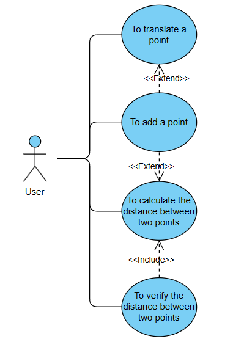
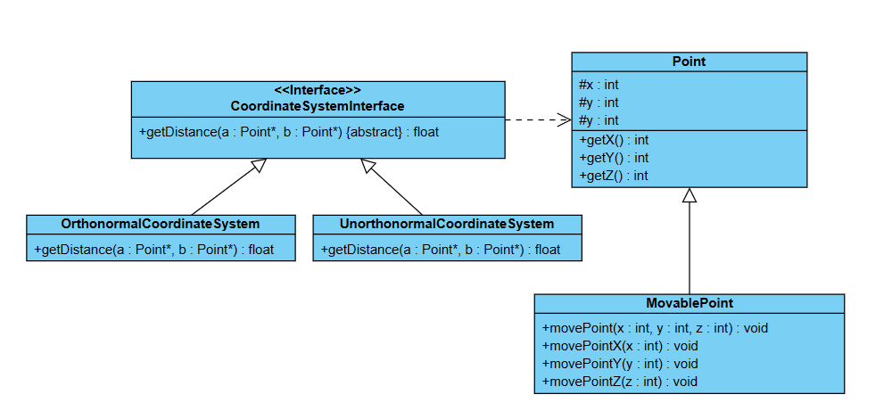
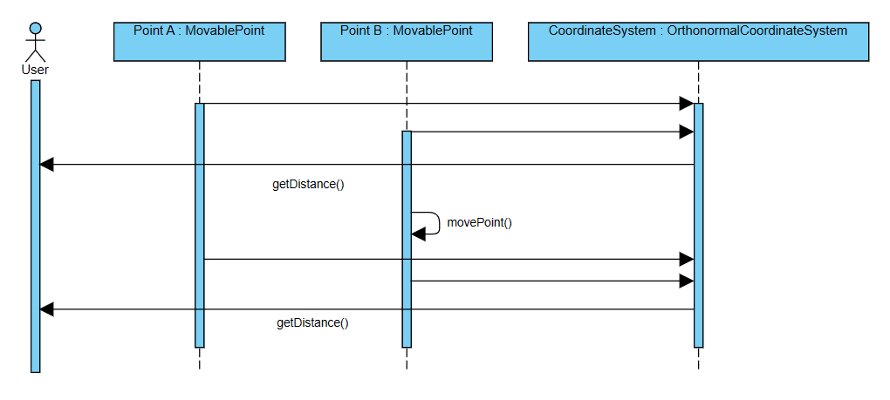
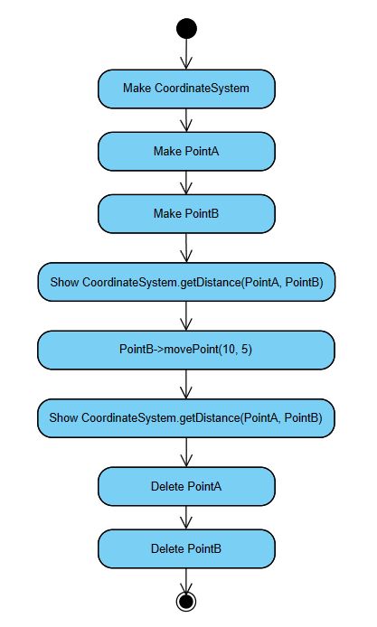

# Program to calculate and verify distance between two points
## Table of contents
- [Introduction](#introduction)
- [Use case diagram](#use-case-diagram)
- [Class diagram](#class-diagram)
- [Sequence diagram](#sequence-diagram)
- [Activity diagram](#activity-diagram)
## Introduction
This program is made to calcultate the distance between two points in an orthonormal coordinate system. It allows users to make points, to translate them and to calculate the distance between points.
This is made to evolue and allows to add unorthonormal coordinate systems, to make all points we want and to evolue for more than 3 dimensions.
## Use case diagram

## Class diagram

- Point manages entities known as points and retrieves information about their coordinates.
- MovablePoint is a point that can be moved. MovablePoint includes methods for moving the point.
- CoordinateSystemInterface is an interface implemented by coordinate systems. This enforces defining, for each coordinate system, a common method that calculates, based on the nature of the coordinate system, the distance between two points in that system. This interface aligns with the program's need for scalability and anticipates the potential need to use non-orthonormal coordinate systems.
- OrthonormalCoordinateSystem and UnorthonormalCoordinateSystem are two coordinate systems, respectively orthonormal and non-orthonormal. They implement the CoordinateSystemInterface.
## Sequence diagram

## Activity diagram

