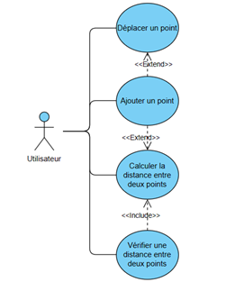
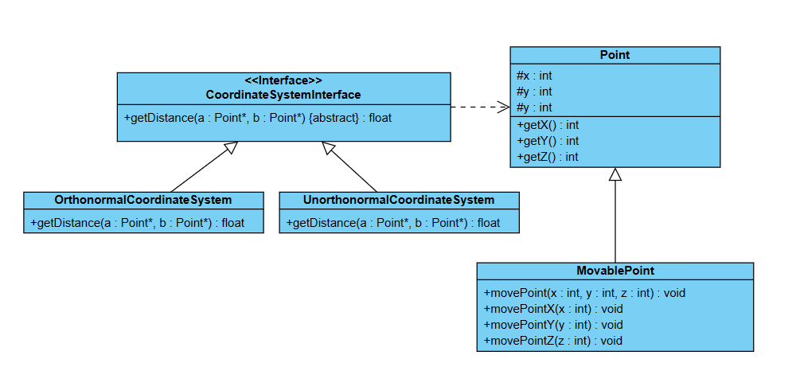

# Program to calculate and verify distance between two points
## Table of contents
- [Introduction](#introduction)
- [Use case diagram](#use-case-diagram)
- [Class diagram](#class-diagram)
## Introduction
This program is made to calcultate the distance between two points in an orthonormal coordinate system. It allows users to make points, to translate them and to calculate the distance between points.
This is made to evolue and allows to add unorthonormal coordinate systems, to make all points we want and to evolue for more than 3 dimensions.
## Use case diagram

## Class diagram

